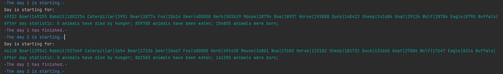
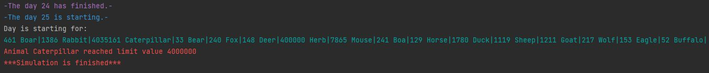

# Project2-WildIsland

JavaRushUniversity course project2

Данный проект создан в рамках курса JavaRushUniversity и реализует модель острова с изменяемыми параметрами,
состоящую из массива локаций (100х20 клеток). Локации заполнены растительностью и животными. Животные могут:

- есть растения и/или других животных (если в их локации есть подходящая еда),
- передвигаться (в соседние локации),
- размножаться (при наличии пары в их локации),
- умирать от голода или быть съеденными.

Сущности острова представлены следующим образом:
- Хищник: Волк, Удав, Лиса, Медведь, Орел
- Травоядные: Лошадь, Олень, Кролик, Мышь, Коза, Овца, Кабан, Буйвол, Утка, Гусеница
- Растения

Все виды происходят от одного абстрактного класса Animal, который содержит поведение, общее для всех животных. Каждый вид
животных имеет характеристики:
- Вес одного животного, кг.
- Максимальное количество животных этого вида на одной клетке
- Скорость перемещения, не более чем, клеток за ход
- Сколько килограммов пищи нужно животному для полного насыщения

    Программа стартует с первичной генерации локации и всех сущностей для начала симуляции. Локация представлена классом 
**island.IslandArea**, и по факту представляет собой массив объектов (ячеек) **island.IslandAreaCell**. 
За генерацию сущностей овтечают классы **island.CellsGenerator** и **island.WorldGenerator**. В каждой ячейке создается случайное количество
каждого из видов но не больше максимального значения хранящегося в Constants.

Далее происходит создание дня острова (класс **time.IslandDay**) который является нитью, которая в свою очередь создает
**FixedThreadPool** потоков для выполнения. Количество доступных ядер высчитывает метод **coresCalculate()**. 
>ExecutorService dayExecutor = Executors.newFixedThreadPool(coresCalculate()); 

Каждая из задач поступаемых в **FixedThreadPool** это нить одной конкретной ячейки острова (класс **time.CellDay**) 
которая в результате своего выполнения возвращает объект класса **statistics.IslandDayResult** со статистикой прошедшего дня. 
Внутри каждой из таких задач животные делятся на случайные пары и в зависимости от участников таких пар происходит либо
процесс поедания одной сущностью другой (если таковое определено в **HashMap<String, Integer> eatingProbability** для каждого животного),
либо размножение (вероятность положительного исхода **REPRODUCE_PROBABILITY = 50 %**). И поедание и размножение влияют на параметр насыщения, от которого зависит
что произойдет с животным в конце дня. Если насыщение животного упало ниже **SATIETY_FOR_DEATH = 0.3** (ниже 30 процентов) животное 
в конце дня погибает.
По итогу дня формируется статистика и новое множество сущностей острова и на основании этих данных в **time.IslandDay** происходит
подготовка острова для следующего дня: животные в зависимости от своей скорости передвигаются, происходит регенерация растений.
На основании этих действий формируется остров готовый к началу нового дня. Так же происходит вывод статистики на экран.

**Результат выполнения** 

Здесь информация о количестве начавших день на острове сущностей и итоговая статистика по прошествии дня:
- количество умерших от голода
- количество съеденых животных
- количество рожденных животных

Количество дней симуляции задает пользователь при старте программы. Выполнение симуляции так же ограничено максимальным количеством
каждого вида на острове (MAX_ISLAND_ITEM_VALUE = 4_000_000L).

